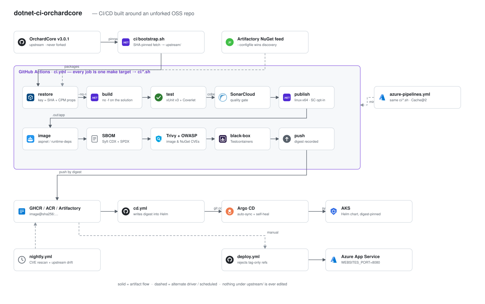

# dotnet-ci-orchardcore

A full .NET CI/CD pipeline built **around** an unforked OSS project:
[OrchardCMS/OrchardCore](https://github.com/OrchardCMS/OrchardCore) pinned at
`v3.0.1` / `b9c4b2f23e56ef11fbdbd28603c871d1b0fc9deb`.

Upstream is fetched at that SHA into `upstream/` and never patched. The single point of
coupling is `ci/upstream.env`.

```
restore ─ build ─ test+coverlet ─ sonarcloud ─ publish ─ image ─ sbom ─ trivy/owasp ─ blackbox ─ push ─ gitops/deploy
```

## Architecture



Source: [docs/architecture.drawio](docs/architecture.drawio) — open or edit it at
[app.diagrams.net](https://app.diagrams.net), in the VS Code *Draw.io Integration*
extension, or in the desktop app. Regenerate the SVG after editing by exporting from
draw.io (File → Export as → SVG) over `docs/architecture.svg`.

## Layout

| Path | What |
| --- | --- |
| `ci/` | every pipeline stage as a standalone bash script |
| `ci/upstream.env` | the pin: repo, SHA, project paths, TFM, RID |
| `ci/gates.env` | thresholds: coverage, Trivy severity, OWASP CVSS, SBOM floor |
| `ci/nuget/` | `public.config` (nuget.org) and `artifactory.config` (enterprise proxy) |
| `ci/docker/` | runtime image, base swaps on `SELF_CONTAINED` |
| `it/` | xUnit v3 + Testcontainers black-box suite against the built image |
| `helm/`, `argocd/` | digest-pinned chart and the Argo CD application |
| `.github/workflows/` | `ci` → `cd` (GitOps digest write) → `nightly` (rescan + drift), plus `deploy` (App Service / AKS, digest-only) |
| `azure-pipelines.yml` | the same scripts under Azure DevOps `Cache@2` |
| `docs/` | `ci-quirks.md`, `runbook.md`, `decisions.md` |

## Run it

```bash
make bootstrap
make ci
```

Every CI job is one `make` target — the YAML only schedules.

## Stack

dotnet 10 CLI · xUnit v3 (Microsoft.Testing.Platform) · Coverlet console · SonarCloud ·
Trivy · OWASP dependency-check · Syft (CycloneDX + SPDX) · Testcontainers .NET ·
GitHub Actions + Azure Pipelines · Artifactory NuGet virtual feed · GHCR / ACR ·
Helm + Argo CD · Azure App Service for Containers / AKS · Codecov

The parts that make .NET CI awkward — the MTP runner, Central Package Management and
cache keys, upstream's own `NuGet.config` winning config discovery, self-contained publish
picking a different base image, why .NET Aspire does *not* replace Testcontainers on an
upstream you cannot edit — are written up in [docs/ci-quirks.md](docs/ci-quirks.md) (14 of
them).
